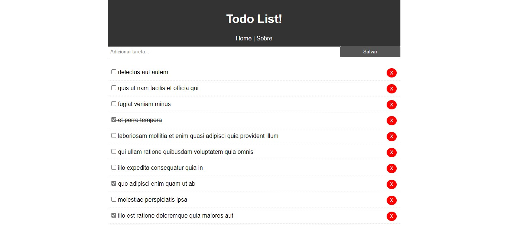

<h1 align="center">
  :pencil: Simple CRUD with Angular
</h1>

- **Project proposed by:** [Traversy Media](https://www.traversymedia.com/)
- **Project developed by:** [Julio L. Muller](https://github.com/juliolmuller)
- **Released on:** Jan 23, 2020
- **Updated on:** Aug 19, 2020
- **Latest version:** 1.1.2
- **License:** MIT



CRUD application developed in order to learn the latest edition of the framework Angular (rest in piece, AngularJS :broken_heart:). Completely based on Traversy Media's [crash course available in YouTube](https://www.youtube.com/watch?v=Fdf5aTYRW0E).

[Check out the application running!](https://juliolmuller.github.io/crud-angular).

## :trophy: Lessons Learned

- Angular application;
- TypeScript syntax:

## :hammer: Technologies & Resources

**Frontend:**
- Angular 9

**Development:**
- Visual Studio Code
- Node.js routines

## :zap: Features

- Fetch dummy tasks from [JSON Placeholder REST API](https://jsonplaceholder.typicode.com/);
- Create new task;
- Mark task as completed;
- Delete existing task;

## :bell: Setting up the Environment

Make sure to have **Node.js 10+** installed in your machine and its **npm** available in the command line, then use the following routines:

```bash
$ npm install   # Download dependencies
$ npm start     # Run development server
$ npm run build # Build files for production
```
